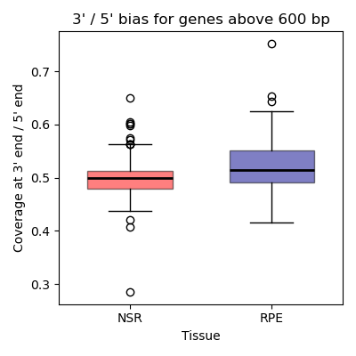
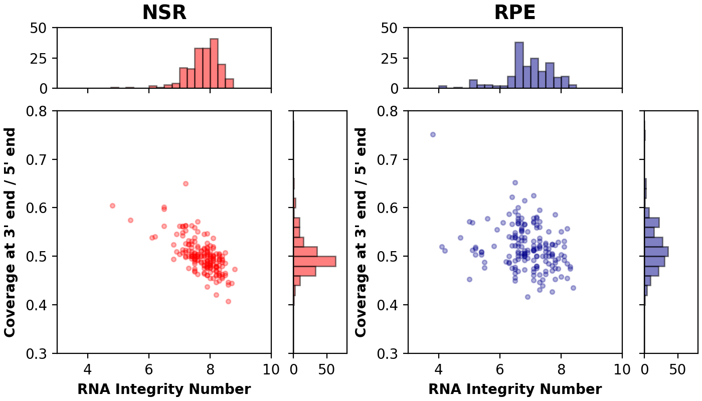

# Relationship between RNA integrity number and other RNASeq QC metrics

## Introduction

The METR-GT cohort has a relativley high PMI time (median = 40 hours). Therefore, we wanted to investigate whether this could compromise measures of RNA integrity (RNA Integrity Number) and other RNA sequencing QC metrics (such as 3'/5' bias or read length).

## Results

### PMI time and RIN

The median RNA Integrity number for NSR samples is 7.9, and for RPE is 6.9 (Fig1). The RIN is greater or equal to 7 for 169 NSR samples and 82 RPE samples.
There wasn't a noticeable decrease in RIN scores in samples with high PMI time (> 40 hours) (Fig2).  

To investigate if 5' bias could impact our results, we used the 3'/5' bias metric from RNASeQC. According to their documentation (https://github.com/getzlab/rnaseqc/blob/master/Metrics.md), this metric captures the ratio of sequencing depth between the 3' end of the gene (150 bp region) and the 5' end of the gene (150 bp region) for genes with a length greater than 600 bp and with at least 5 unambiguous reads.
A gene with even coverage in both its 3' and 5' windows will have a bias of 0.5, values near 1 or 0 indicate degradation.

The median 3'/5' bias in NSR samples was 0.5 (IQR=0.48-0.51), and in RPE was 0.51 (IQR=0.49-0.55) (Fig3). The samples with the highest 3' bias scores (indicating degradation at the 5' end) had lower RNA Integrity Numbers, but there were ## NSR and RPE samples where `RIN < 7` with a 3'/5' bias score within 0.4 and 0.6.

*Figure 1. RNA Integrity Number distribution for NSR and RPE samples in METR-GT cohort*

*Figure 2. Relationship between PMI time and RNA integrity numbers*

*Figure 3. 3'/5' bias scores for NSR and RPE samples*

*Figure 4. The relationship betwen RNA Integrity Numbers and 3'/5' bias*

