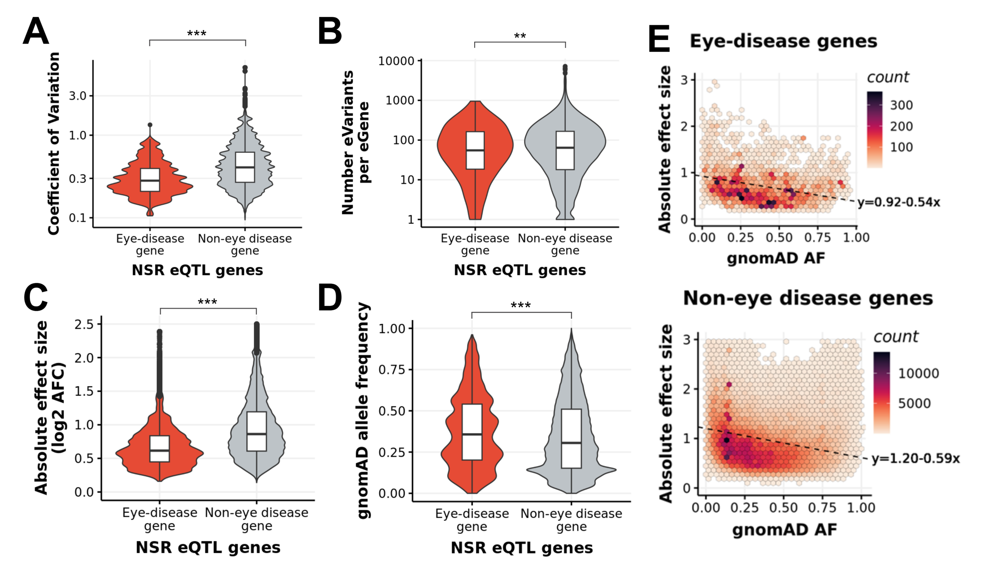
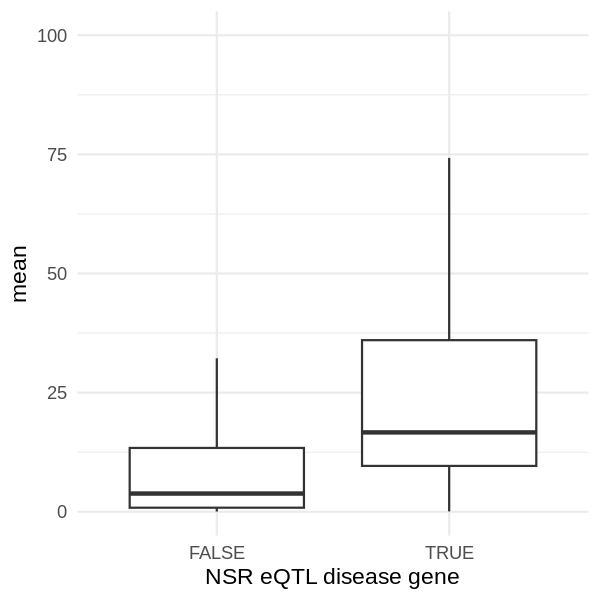
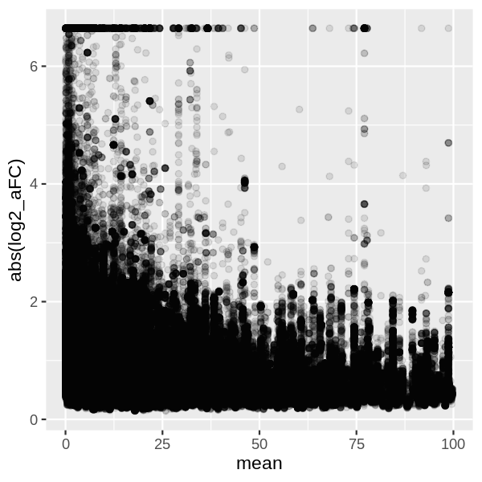
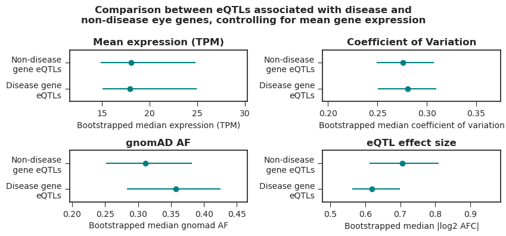

# Properties of eQTL variants associated with eye disease genes compared to non-eye disease genes.
<!-- vim-markdown-toc GFM -->

* [Background](#background)
* [Methods](#methods)
* [Results](#results)
* [Conclusion](#conclusion)

<!-- vim-markdown-toc -->
## Background
In the eQTL manuscript we claim that eQTLs associated with genes known to cause eye disease have different properties to those associated with genes that are not known to cause eye disease. Specifically, we show that the allele frequency on gnomad of the disease gene eQTLs is higher than non-disease gene eQTLs and that the effect size (measured by the log2 allelic fold change) of the disease gene eQTLs is lower than the non-disease gene eQTLs (fig 1). 
However, a reviewer hypothesised that the only reason we see this association is because eye disease genes are more likely to have higher expression in the retina than non-eye disease genes. As a result, the effect size of an eQTL variant on a gene with lower expression is more likely to be higher than the effect size of an eQTL on a gene with greater expression (i.e. the difference between 0.1 to 1 TPM is a huge effect size and statistical significance compared to 100 TPM to 150 TPM).

*Figure 1. Figure included in the manuscript of the properties of eQTLs associated with disease and non-disease eQTLs*
Therefore, I wanted to explore:

1. The relationship between mean gene expression and whether the gene is associated with eye disease or not. 
2. The relationship between mean gene expression and the effect size (in log2 AFC) of associated eQTL variants.
3. If we still see an association between the effect size / allele frequency of an eQTL variant and disease/non-disease genes when controlling for mean expression.

## Methods

First, create relevant plots to explore: 

1. The relationship between mean gene expression and whether the gene is associated with eye disease or not. 
2. The relationship between mean gene expression and the effect size (in log2 AFC) of associated eQTL variants.

To determine if we still see an association between the effect size / allele frequency of an eQTL variant and disease/non-disease genes when controlling for mean expression, I decided to carry out a simple bootstrapping experiment (n = 1000 iterations)using the following steps in each iteration:

1. Randomly select 100 eQTLs associated with eye disease genes.
2. Randomly select 100 eQTLs associated with non-eye disease genes, but match the mean gene expression (+-5%) of the associated eGene to the mean expression of the eye disease genes associated with the 100 randomly selected eQTLs in step 1.
3. Calculate the median expression and coefficient of variation for the eGenes associated with the eQTLs in subsets 1) and 2), and calculate the median gnomad AF and log2 AFC for the eQTL variants selected in subsets 1) and 2). 
4. Append the medians to a master list for the eye disease and non eye disease eQTLs.

Therefore, the final product after running the 1000 iterations is two sets of median values for the eGene expression, eGene coefficient of variation, eQTL AF and eQTL effect size for disease gene and non-disease gene eQTLs. We can then calculate the median of these lists and the 95% confidence interval and create a simple plot.

## Results

*Figure 2. Mean expression of eGenes associated with known eye disease genes (TRUE) and non-eye disease genes (FALSE*)

*Figure 3. Mean gene expression plotted against the log2 AFC (effect size) for each NSR eQTL*

*Figure 4. Results from the bootstrapping analysis comparing the properties of eQTLs associated with known eye diseases to those which are not known to cause eye disease, controlling for mean gene expression*

##Conclusion

