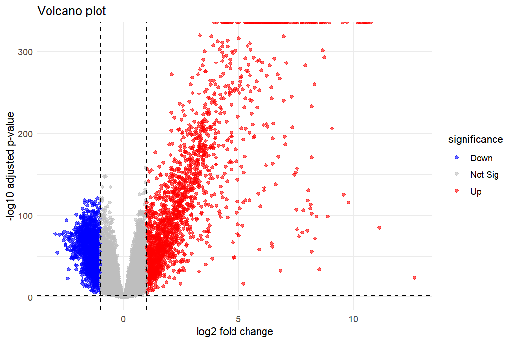
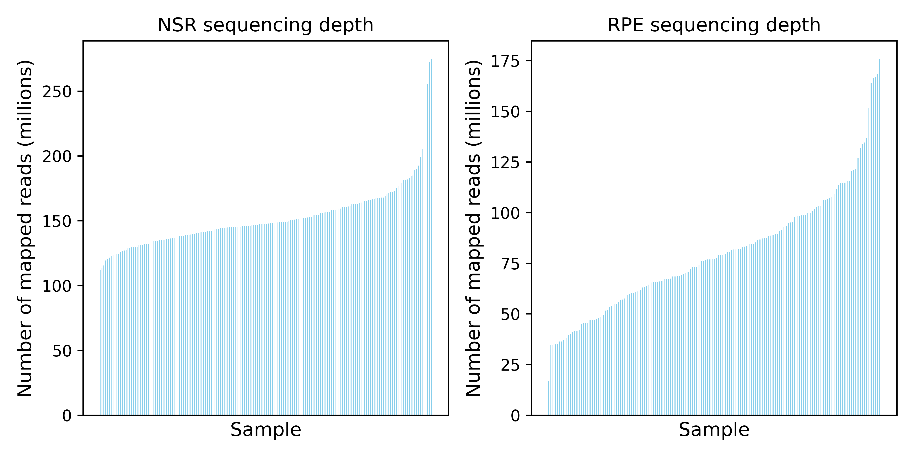
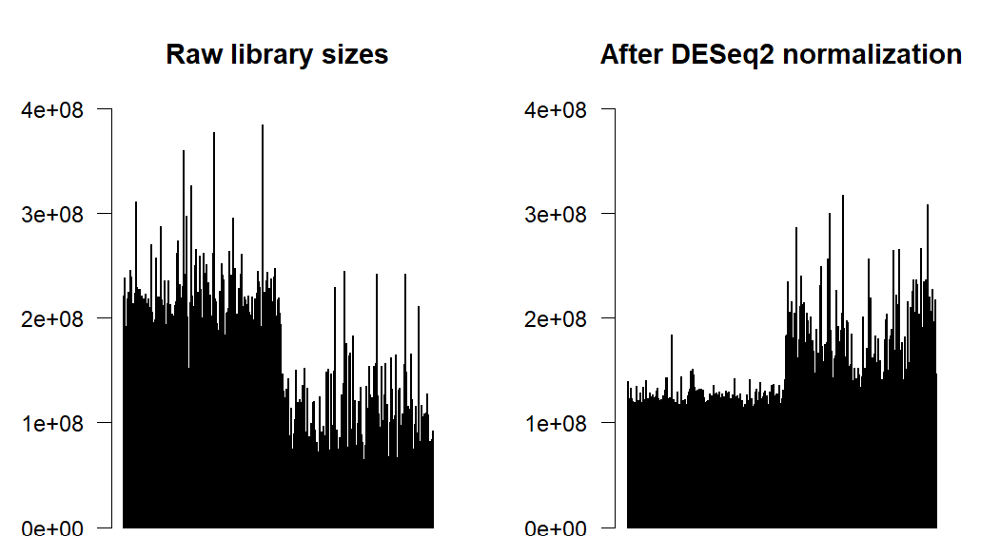
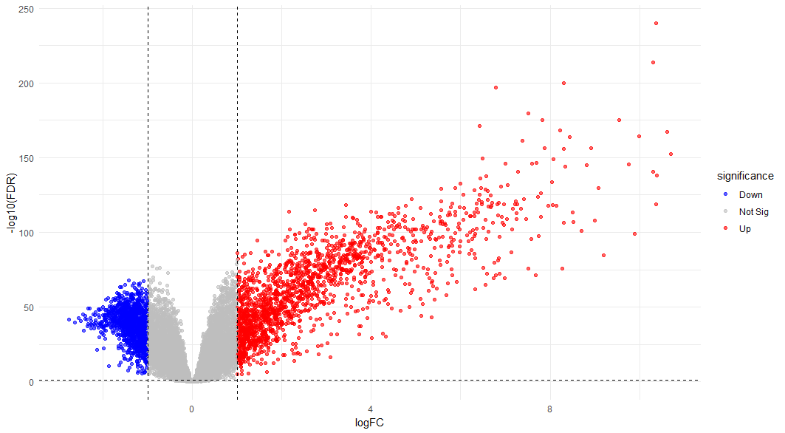

# Differential expression analysis between NSR and RPE

<!-- vim-markdown-toc GFM -->

* [DeSeq analysis](#deseq-analysis)
    * [**Input**:](#input)
    * [**Code:**](#code)
    * [**Output**:](#output)
* [EdgeR analysis](#edger-analysis)
    * [**Input**:](#input-1)
    * [**Code:**](#code-1)
    * [**Output**](#output-1)

<!-- vim-markdown-toc -->
## DeSeq analysis

### **Input**:

* *Genes*: Merged all genes expressed in NSR and RPE and filtered out those where `mean TPM < 1` and genes that have a count of at least 10 in 20% of samples. Genes remaining after filtering: **17751**
* *Library normalisation*: Used default DeSeq library normalisation
* *FDR threshold*: 0.05

### **Code:**
```R
### Run DESEQ2

library('DESeq2')

dds <- DESeqDataSetFromMatrix(countData = cts_filt,
                             colData = coldata,
                             design = ~ age + sex + tissue
                            )

# Keep genes that have a count of at least 10 in 20% of samples

smallestGroupSize <- 0.2 * number_samples
keep <- rowSums(counts(dds) >= 10) >= smallestGroupSize
dds <- dds[keep,]

dds <- estimateSizeFactors(dds)

# Differential expression analysis

dds <- DESeq(dds)
res <- results(dds, contrast = c('tissue', 'RPE','NSR'))
```

### **Output**:
```
out of 17751 with nonzero total read count
adjusted p-value < 0.05 RPE vs NSR expression
LFC > 0 (up)       : 7353, 42%
LFC < 0 (down)     : 7604, 43%
outliers [1]       : 3, 0.017%
low counts [2]     : 0, 0%
```

Most genes (14,957 / 17,751) are differentially expressed between NSR and RPE (`FDR < 0.05`) which seems abnormally high. Additionally, the volcano plot (Fig1) suggests that there are a handful of genes that have much higher expression in RPE than in NSR (`p-adj < 1E-100` and `LFC>5`) but we don't see a similar trend with genes which are downregulated in RPE compared to NSR. Considering that the sequencing depth in NSR was much higher than in RPE (Fig2), I investigated whether the library size differences between the two tissues could account for this observation, instead of biological differences between them. Although it might seem counterintuitive that if the NSR library size were bigger then there would be a handful of genes that are massively overexpressed in the RPE relative to the NSR.  

```R
# Raw library sizes
raw_libsizes <- colSums(counts(dds))

# Normalized library sizes
norm_libsizes <- raw_libsizes / sizeFactors(dds)

par(mfrow=c(1,2))
barplot(raw_libsizes, main="Raw library sizes", las= 2, ylim = c(0,4E8))
barplot(norm_libsizes, main="After DESeq2 normalization", las=2, ylim = c(0,4E8))
```


*Figure 1 - Volcano plot after deseq differential expression analysis*

*Figure 2 - Number of mapped reads in NSR samples and RPE samples*

*Figure 3 - Estimated library sizes by DeSeq before and after normalisation*

By plotting the raw library sizes from the `dds` object and comparing to the normalised libraries, there was still a noticible difference between NSR and RPE samples after deseq normalisation. It was very interesting to observe that the normalisation method seemed to overcompensate for the RPE samples, such that the normalised library size for these samples was higher than the NSR samples. This would explain why there were a handful of genes where the log2FC(RPE expression/NSR expression) was so high.I tried to repeat the analysis using different gene thresholds and normalisation methods (`poscounts`) but the results (not shown here) were very similar. 

Therefore, I decided to try a different tool for differential expression analysis: **edgeR**.


## EdgeR analysis

### **Input**:

* *Genes*: First applied a mean TPM threshold of 1. Then used default edgeR `filterByExpr` function which filters out genes with low expression and uses an adaptive threshold based on library size. Remaining genes after filtering: **17,718** 
* *Library normalisation*: Used the default method to normalise library sizes in edgeR, which uses a trimmed mean of M-values (TMM) algorithm.  
* *FDR threshold*: 0.05

### **Code:**
```R
library(edgeR)
y = DGEList(counts = cts, group = coldata$tissue)

# Filter out low expressed genes (adaptive threshold based on library size) and normalise using TMM method
keep <- filterByExpr(y, group = coldata$tissue)
y <- y[keep, , keep.lib.sizes=FALSE]
y <- calcNormFactors(y, method = "TMM")

# Construct the design matrix
design <- model.matrix(~ tissue + sex + age, data = coldata)
colnames(design)

#Estimate dispersion and fit the model
y <- estimateDisp(y, design)
fit <- glmQLFit(y, design)

qlf <- glmQLFTest(fit, coef = "tissueRPE")
edger_res <- topTags(qlf, n = Inf)$table
```

### **Output**
```
out of 17,718 input genes
adjusted p-value < 0.05 RPE vs NSR expression
LFC > 0 (up)       : 7,875 44%
LFC < 0 (down)     : 7,038 40%
```

We still observe the same skewed log fold changes suggesting a set of genes in the RPE are much more highly expressed than the NSR (Fig4). We could try to apply more stringent TPM thresholds prior to the analysis, but otherwise, we have limited options to resolve this issue.


*Figure 4. Volcano plot generated after differential expression analysis between the RPE and the NSR in edgeR.*

