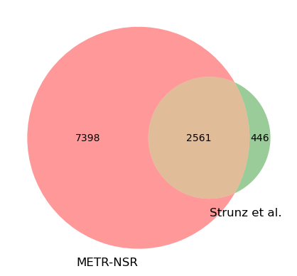
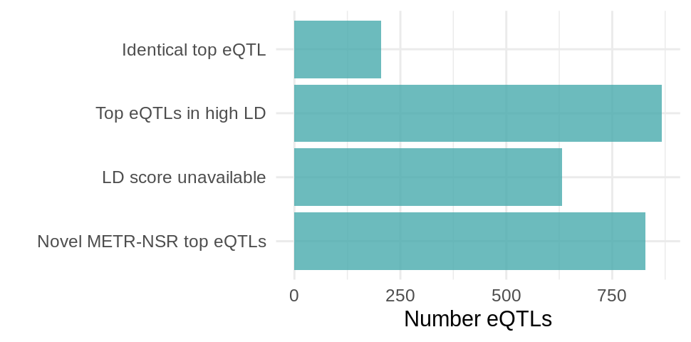

# Comparison between METR-eQTL dataset and eQTLs from Stunz et al. (2020)

## Introduction

Following comments by the reviewers of our manuscript, we thought it would be appropriate to extend the METR eQTL comparison to an additional retina eQTL study by Strunz et al. (2020).

## Methods

We downloaded eQTLs from Strunz et al. here: https://myfiles.uni-regensburg.de/ssf/s/readFile/share/37554/1498947399071012793/publicLink/Retina_merged3_hg38_FastQTL_eVariants_chrALL_FDR_0.05.txt 

We intersected the eGenes and eVariants from Strunz with METR-NSR eQTLs. To intersect eVariants we used dbSNP rsIDs.
For eGenes shared between METR-NSR and Stunz we proceeded to determine if the eGenes shared the top eVariant or if the top METR eVariant was in high LD with the top Strunz eVariant (`r2 > 0.8`). 
For the LD analysis we used the R tool LDlink.

## Results

### Description of Strunz et al. eQTLs
| Strunz et al. (2020) | Count |
| --- | --- |
| Number of eQTLs | 580,170 | 
| Number of eGenes | 3,007 |
| Number of eVariants | 403,151 |

### Intersection between Strunz and METR eGenes

Of the 3,007 eGenes identified by Strunz et al, we identified 2,561 eGenes in the METR cohort (Fig 1A).
We then investigated the overlap between shared top eQTL variants for the eGenes identified in both studies (Fig1B). 

|    | category                 |   Number_eQTLs |
|---:|:-------------------------|---------------:|
|  0 | Identical top eQTL       |            205 |
|  1 | Top eQTLs in high LD     |            867 |
|  2 | LD score unavailable     |            631 |
|  3 | Novel METR-NSR top eQTLs |            828 |

  
  

*Figure 1. A. Overlap between eGenes in Strunz et al (2020) and METR-NSR. B. For the 2,561 eGenes shared between both studies, we calculated the overlap between the top eQTL variants for each eGene.* 
